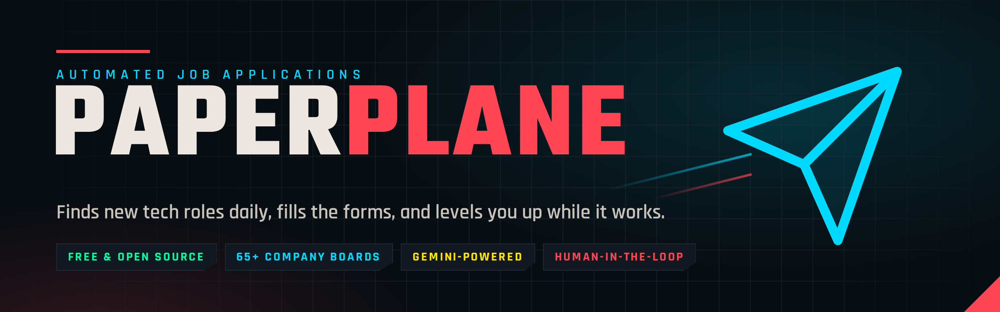
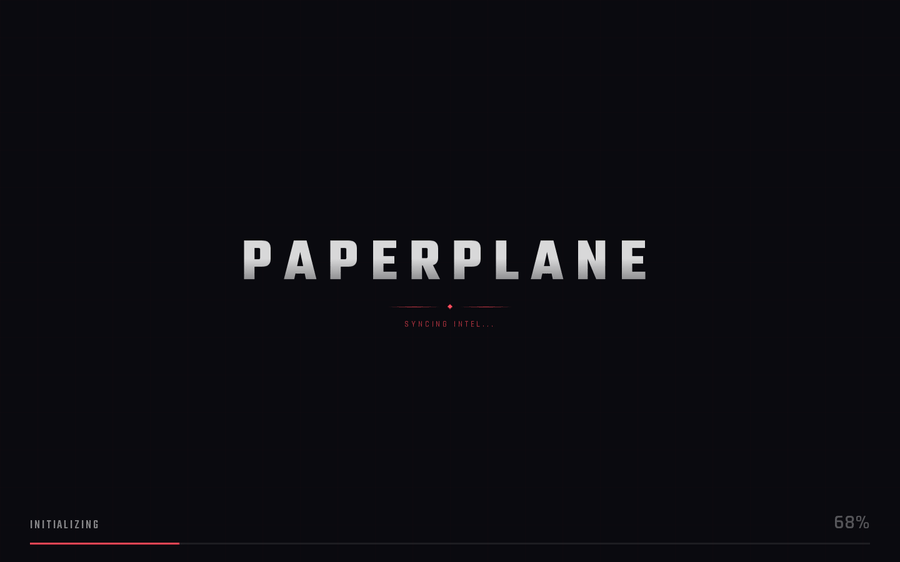
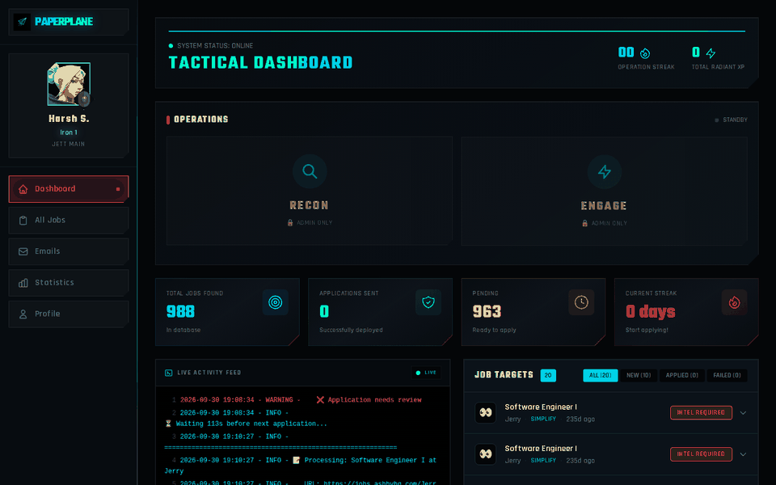
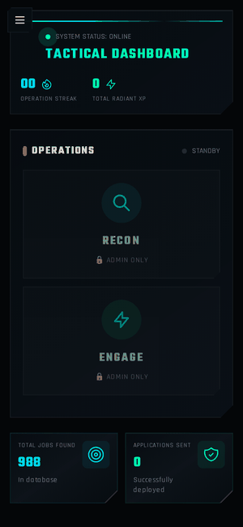
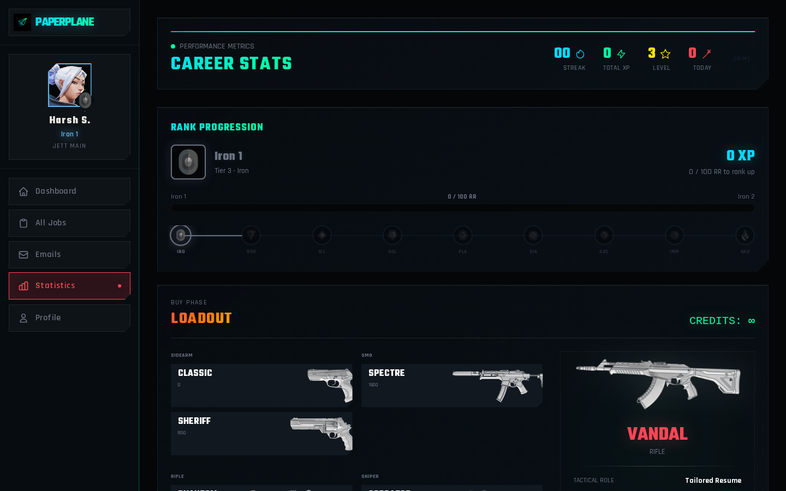
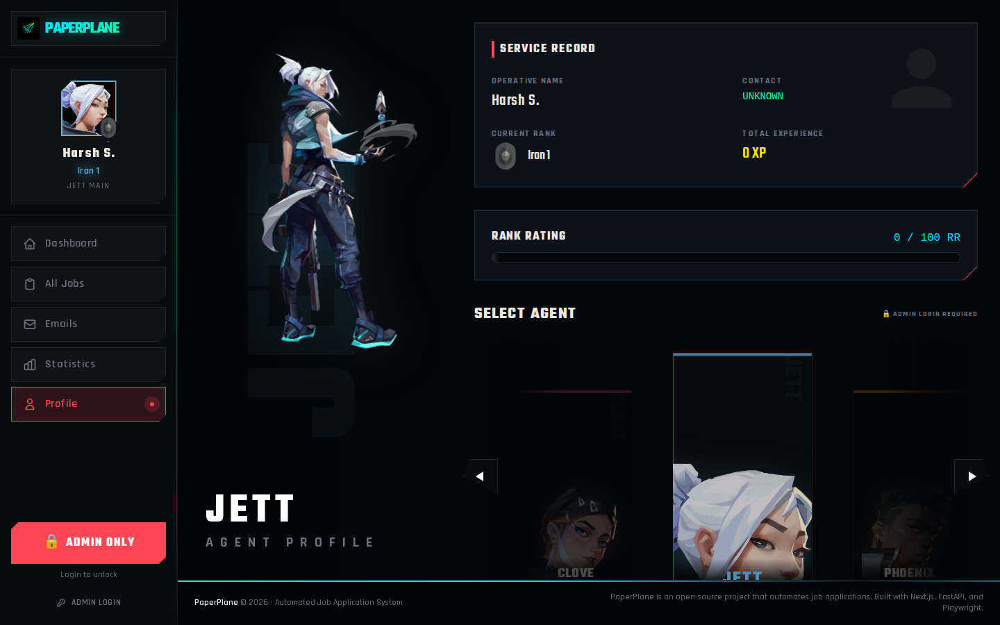
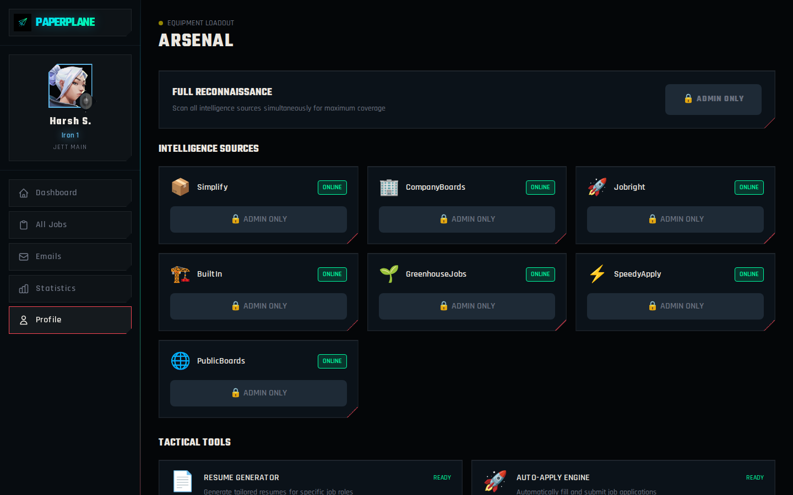
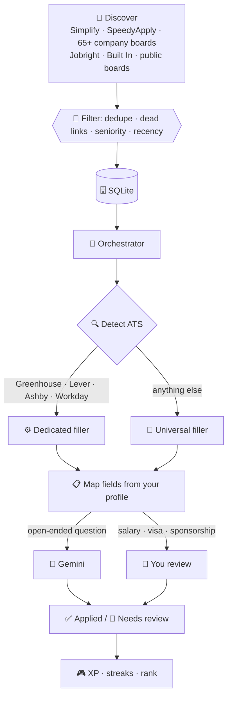
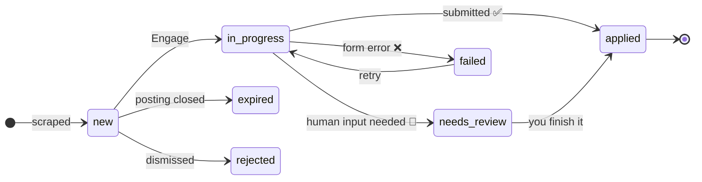
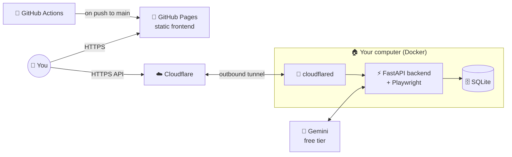

<div align="center">



<br>

**Your job hunt, on autopilot.**<br>
PaperPlane finds new tech roles every day, fills the application forms for you, asks an LLM only when it has to,<br>and turns the grind into a game: XP, streaks and Valorant-style ranks.

<br>

[](https://paperplane.harshsh.com)
[](https://github.com/Harsh-H-Shah/PaperPlane/actions/workflows/deploy.yml)
[](https://github.com/Harsh-H-Shah/PaperPlane/stargazers)


[](LICENSE)
[](#-contributing)

[**Live demo**](https://paperplane.harshsh.com) · [**Quick start**](#-quick-start) · [**How it works**](#-how-it-works) · [**Run it for $0**](#-run-it-for-0) · [**Roadmap**](#%EF%B8%8F-roadmap)

<br>



</div>

---

## 🎯 Why PaperPlane?

Applying to entry-level tech jobs is a numbers game: the same name, email, links and "why this company?" answers, typed into a different form a hundred times. PaperPlane does the repetitive part and leaves you the judgment calls.

- 🛰️ **It finds the jobs.** Seven scrapers, including 65+ top-company boards, pull fresh software roles and filter out senior, stale and non-tech postings.
- 📝 **It fills the forms.** It recognizes the major applicant tracking systems (Greenhouse, Lever, Ashby, Workday and more) and fills each field from your profile.
- 🧠 **It thinks only when needed.** Simple fields are resolved from your profile with no API call; only open-ended questions go to Gemini (the free tier is enough).
- 🙋 **You stay in control.** Salary, visa, sponsorship and similar questions are always flagged for you, and `AUTO_SUBMIT` is off by default.
- 🎮 **It makes the grind fun.** Every application earns XP, keeps your streak alive and climbs you from Iron to Radiant.

## ✨ Features

<table>
<tr>
<td width="50%" valign="top">

### 🔭 Job discovery
- **Simplify** & **SpeedyApply** new-grad and internship lists
- **65+ company boards** via their public ATS APIs (one line of YAML per company)
- **Jobright**, **Built In**, **Greenhouse** job search
- **Public boards:** Remotive, RemoteOK, Jobicy, Himalayas, We Work Remotely and more
- Deduplication, dead-link checks and seniority/recency filters

</td>
<td width="50%" valign="top">

### ⚙️ Form filling
- ATS detection for **Workday, Greenhouse, Lever, Ashby, iCIMS, Taleo, SmartRecruiters, Jobvite, Oracle, ADP**
- Dedicated fillers for **Greenhouse, Lever, Ashby, Workday**, plus a universal filler and redirect handling
- Resume upload and profile-driven field mapping
- One-click apply from the dashboard, or `apply` from the CLI

</td>
</tr>
<tr>
<td valign="top">

### 🧠 LLM, used sparingly
- **Gemini 3.5 Flash-Lite** by default, which fits in the free tier
- Built-in rate limiting and daily usage tracking (`llm-usage`)
- Answer validation, plus an always-review list for sensitive questions

</td>
<td valign="top">

### 🕹️ Mission control dashboard
- Live activity feed, job targets and one-click **Recon** (scrape) / **Engage** (apply)
- XP, streaks, daily and weekly quests, and **Iron → Radiant** ranks
- Cold-email outreach: contacts, templates, scheduling and follow-ups
- Fully responsive, with a public read-only view and a token-protected admin mode

</td>
</tr>
</table>

## 📸 Take a look

<table>
<tr>
<td width="68%" align="center"><br><sub><b>Active Missions:</b> search, filter and apply across every source</sub></td>
<td width="32%" align="center"><br><sub><b>Mobile:</b> the whole dashboard in your pocket</sub></td>
</tr>
</table>

<table>
<tr>
<td align="center"><br><sub><b>Career stats:</b> rank progression and loadout</sub></td>
<td align="center"><br><sub><b>Agent profile:</b> pick your Valorant agent</sub></td>
<td align="center"><br><sub><b>Arsenal:</b> every intelligence source, one click away</sub></td>
</tr>
</table>

## 🧭 How it works



Every job moves through a simple lifecycle, and the dashboard shows each state with its own game-style label:



## 🚀 Quick start

**You'll need:** Python 3.11+, Node.js 20+, and a free [Gemini API key](https://aistudio.google.com/apikey).

```bash
git clone https://github.com/Harsh-H-Shah/PaperPlane.git
cd PaperPlane

# Backend
cd backend
python -m venv .venv && source .venv/bin/activate
pip install -r requirements.txt
playwright install chromium
python main.py init          # creates .env and data/profile.json from the examples
```

Fill in `.env` (at least `GEMINI_API_KEY`, plus an `ADMIN_TOKEN` of your choice) and your details in `data/profile.json`. Then:

```bash
# Terminal 1: API on :8080
cd backend && source .venv/bin/activate && python main.py dashboard

# Terminal 2: dashboard on :3000
cd frontend && npm install && npm run dev
```

Open **http://localhost:3000**, log in with your `ADMIN_TOKEN`, hit **Recon** to scrape, then **Engage** to start applying.

<details>
<summary><b>🐳 Prefer Docker?</b></summary>

```bash
docker compose up -d --build    # backend on :8080, frontend on :3000
```

Runtime data lives in `data/` and `logs/`, mounted into the container.
</details>

## 🕹️ CLI

Everything the dashboard does is also available from the terminal: `python main.py <command>`.

| Command | What it does |
| --- | --- |
| `init` | Create `.env` and `data/profile.json` from the examples |
| `status` | Show configuration and job statistics |
| `scrape` | Discover new jobs (`--source`, `--limit`) |
| `jobs` | List jobs, optionally filtered by status |
| `add-job` | Add a job manually |
| `apply` | Apply to pending jobs |
| `apply-url` | Apply to a single job URL |
| `dashboard` | Start the API server |
| `job-stats` | Breakdown of jobs by source and status |
| `llm-usage` / `test-llm` | Check Gemini usage, or send a test prompt |
| `h1b-sponsors` | Fetch H1B sponsor company data |
| `config` / `version` | Show the active config, or the version |

## 💸 Run it for $0

The live demo at **[paperplane.harshsh.com](https://paperplane.harshsh.com)** runs on this exact setup, with no servers to rent:



| Piece | Service | Cost |
| --- | --- | --- |
| Frontend | GitHub Pages (static export) | $0 |
| Backend | Your own computer, via Docker | $0 |
| HTTPS + public URL | Cloudflare Tunnel (no open ports) | $0 |
| LLM | Gemini API free tier | $0 |
| CI/CD | GitHub Actions | $0 |

Both containers restart on their own after a crash or reboot. Want it running 24/7 instead? [HOSTING.md](HOSTING.md) also covers a Google Cloud VM (about $3.65/month).

## 🧩 Chrome extension (in progress)

A standalone Manifest V3 extension in [`extension/`](extension/) brings the same field mapping and answer prompts to any page you're on, no backend needed. It adds answer learning, a review step for sensitive fields, and an optional local Ollama engine. Some of its source files still need to be committed before it builds ([#10](https://github.com/Harsh-H-Shah/PaperPlane/issues/10)); see [extension/README.md](extension/README.md).

## 🗺️ Roadmap

- [x] Seven job scrapers, including 65+ company boards
- [x] Dedicated fillers for Greenhouse, Lever, Ashby and Workday
- [x] Gamified dashboard with ranks, streaks and quests
- [x] Free hosting: GitHub Pages + Cloudflare Tunnel
- [ ] Fix the remaining apply-pipeline bugs ([#3](https://github.com/Harsh-H-Shah/PaperPlane/issues/3))
- [ ] Remember answered questions and reuse them across applications
- [ ] Scheduled daily scrape and apply runs
- [ ] Commit the extension's core modules ([#10](https://github.com/Harsh-H-Shah/PaperPlane/issues/10))
- [ ] Automated test suite for the backend

## 🤝 Contributing

Contributions are welcome, whether it's a new job source, an ATS filler, or a UI polish.

1. Fork the repo and create a branch.
2. Keep the backend lint clean: `cd backend && ruff check src/`.
3. Open a PR describing what changed and how you tested it.

**Easy first contribution:** add a company to [`config/company_boards.yaml`](config/company_boards.yaml), which is one line per company with no code changes. More background is in [DOCS.md](DOCS.md) and [docs/JOB_INGESTION_PLAN.md](docs/JOB_INGESTION_PLAN.md).

If PaperPlane saves you some typing, a ⭐ helps other job seekers find it.

<a href="https://star-history.com/#Harsh-H-Shah/PaperPlane&Date">
  <picture>
    <source media="(prefers-color-scheme: dark)" srcset="https://api.star-history.com/svg?repos=Harsh-H-Shah/PaperPlane&type=Date&theme=dark">
    
  </picture>
</a>

## 📜 License & disclaimer

[MIT License](LICENSE). Feel free to use and modify.

PaperPlane is a personal productivity tool. Review what it fills in before anything is submitted, and follow each job platform's terms of service.

<div align="center"><sub>Built with ☕ and too many job applications · <a href="https://paperplane.harshsh.com">paperplane.harshsh.com</a></sub></div>
